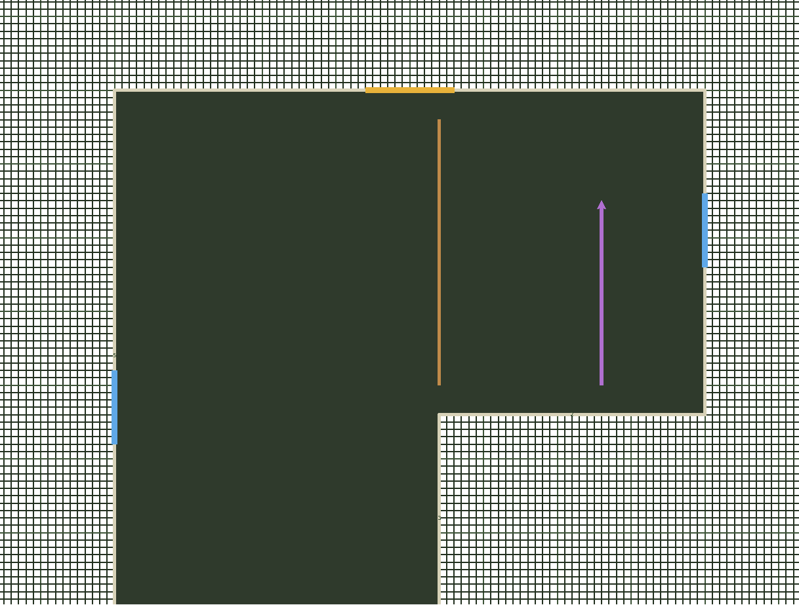
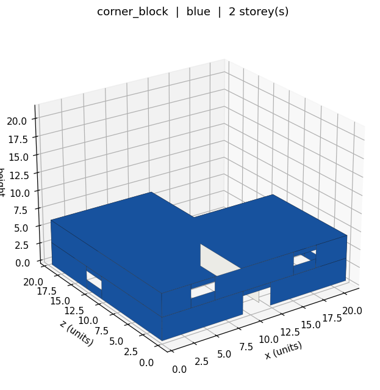

# Lego House Maker

Draw a Lego building in plan view, then export it as JSON for the
[army](https://github.com/CyberDiary2/army) game to build out of bricks.

Same idea as [tinyhome.club](https://tinyhome.club)'s designer: a plan you draw
on, a small JSON document behind it, and a downstream tool that turns that
document into the real thing. Feet are swapped for **studs** and **courses**,
because those are the units you actually think in when you are building with
bricks, and because they are integers, so a design never drifts and two people
always agree on what "12 wide" means.



*The plan view: an L-shaped footprint with a doorway (yellow), windows (blue),
an interior wall (orange) and a ramp climbing north (purple). Exported straight
from the canvas, hence the white background.*



## Running it

No install and no dependencies. Python 3.10+ with tkinter, which ships with
Python:

```sh
python -m legohouse                    # start empty
python -m legohouse designs/cottage.json   # open a design
```

`matplotlib` is optional. With it, the **3D preview** button shows the building
as solid walls with the openings punched through; without it, everything else
still works.

```sh
python -m unittest discover -s tests   # 26 tests, no dependencies
```

## Drawing a building

| Tool | What it does |
| --- | --- |
| **Footprint** | Click each corner. Every wall is forced onto an axis, so you get clean rectilinear shapes: rectangles, L-shapes, U-shapes, courtyards. Click back on the first corner to close it. Right-click or `Ctrl+Z` removes the last corner, `Esc` starts over. |
| **Doorway** | Click on a wall. Goes in at floor level, full door height. |
| **Window** | Click on a wall. Goes in at sill height with a header above it. |
| **Interior wall** | Drag inside the footprint. Axis-locked like the outer walls. |
| **Ramp up** | Click where the ramp starts; the dropdown sets which way it climbs. The arrow shows how far it needs to run. |
| **Erase** | Click any opening, interior wall or ramp on the current storey. |

Wheel zooms, middle-drag pans, and the **storey** buttons add floors, delete
them and switch between them. The footprint is shared by every storey; the
openings, interior walls and ramps belong to the storey you are on.

**Check design** lists everything wrong at once rather than one problem per
attempt, so you can fix a building in one pass.

## Recommended sizes

Studs and courses are unfamiliar units, so the editor shows a normal value under
each control. These are the numbers the game's own buildings already use, and a
soldier is 1.8 world units tall, about 7 brick courses, which is what makes them
feel right.

| | default | why |
| --- | --- | --- |
| wall height | **10 courses** | one storey, 3.2 units. 7 is head height on a soldier; below that it is a crawlspace. 20 makes a tall hall. |
| storeys | **2** | every storey above the first needs a ramp under it, or bots can never reach it |
| doorway | **12 studs** wide | under about 6 and soldiers snag on the frame |
| window | **8 wide, sill 4, height 4** | puts it at chest height on a standing soldier |
| ramp | **12 studs** wide | narrower works, but bots path down the middle and bunch up |
| footprint | **70 x 56 studs** | about 19 x 15 units, the size of the buildings already in the game. Much under 40 x 40 leaves no room inside for a ramp. |

The ramp panel also shows, live, how many studs of run the current wall height
needs, so you can see whether a ramp will physically fit before you place it.

## Why ramps matter

The game's bots path purely on a baked navmesh and **cannot jump at all**. A
floor with no ramp serving it is a floor bots will never reach, however easy it
looks to a player. So the designer treats a storey above ground with no ramp
under it as a problem worth reporting, and it refuses ramps that would run out
through a wall.

Ramp slope is capped at 26 degrees and the run is always rounded **up** to a
whole stud. Rounding down would make the ramp fractionally steeper, and steeper
is the direction that breaks pathing.

## The design file

```json
{
  "schema": 1,
  "name": "cottage",
  "colour": "red",
  "roof": true,
  "footprint": [[0, 0], [70, 0], [70, 56], [0, 56]],
  "storeys": [
    {
      "wall_courses": 10,
      "openings": [
        { "kind": "door", "wall": 0, "from_studs": 29, "width_studs": 12,
          "sill_courses": 0, "height_courses": 8 },
        { "kind": "window", "wall": 1, "from_studs": 20, "width_studs": 10,
          "sill_courses": 4, "height_courses": 4 }
      ],
      "interior_walls": [ { "a": [28, 2], "b": [28, 30] } ],
      "ramps": [ { "at": [66, 40], "direction": "n", "width_studs": 12 } ]
    }
  ]
}
```

- **footprint** is a closed loop of corners in studs. Wall `0` is the edge from
  corner 0 to corner 1, wall `1` from corner 1 to corner 2, and so on, which is
  what an opening's `wall` refers to.
- **from_studs** is measured along that wall from its first corner, so an
  opening keeps its meaning if the building is moved.
- **wall_courses** is the wall height for that storey, in brick courses.
- **direction** on a ramp is `n`, `s`, `e` or `w`, the way it climbs. `+y` is
  south, matching the game's `+z`.

### Units

| | studs / courses | world units | real Lego |
| --- | --- | --- | --- |
| stud pitch | 1 stud | 0.267 | 8 mm |
| brick course | 1 course | 0.32 | 9.6 mm |
| plate | 1/3 course | 0.107 | 3.2 mm |
| wall thickness | 2 studs | 0.534 | a standard brick's depth |

One world unit is 30 mm, which puts a soldier at roughly the size of the minifig
these bricks are made for: a 2x4 brick comes up to about knee height.

## Layout

```
legohouse/
  geometry.py   brick dimensions, footprint maths, ramp slope
  model.py      the design document and every rule it has to satisfy
  app.py        the tkinter plan-view editor
  preview.py    optional matplotlib 3D preview
designs/        example buildings
tests/          26 tests covering geometry, validation, round trips, wall splitting
```

`geometry.py`'s constants must stay in step with the `LEGO_*` constants in the
game's own `tools/build_scenes.gd`, which is where studs and courses finally
become bricks.

## Licence

MIT.
